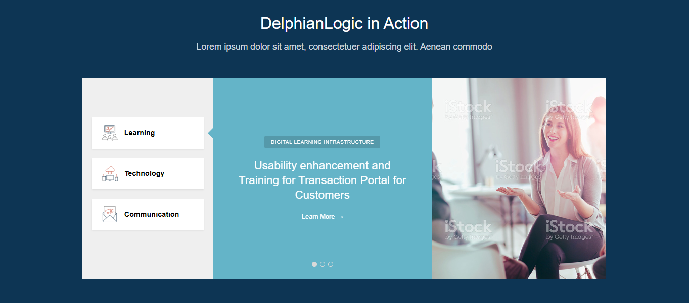
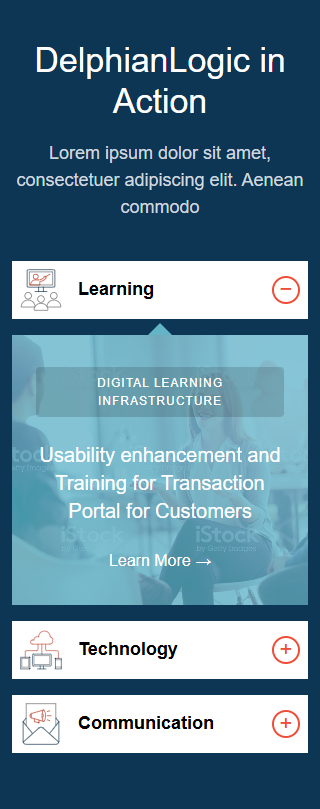

This project is a responsive CRUD application developed using PHP, MySQL, HTML5, CSS3, Bootstrap, and jQuery as part of the technical assignment.

The application follows the provided design requirements and includes responsive behavior for both desktop and mobile devices.

---

## Features

- CRUD functionality using PHP & MySQL
- Responsive UI implementation
- Tab-based slider functionality on desktop view
- Accordion-based layout on mobile view
- Connected image slider behavior
- Bootstrap-based responsive layout
- jQuery slider interactions
- Dynamic data rendering from database

## Technologies Used

- PHP
- MySQL
- HTML5
- CSS3
- Bootstrap
- jQuery
- JavaScript

---

## Project Structure

```text  
project-root/
│
├── admin/
│   └──db/
│       └── sections.sql
│   ├── config.php
│   ├── edit.php
│   └── index.php
│
│
├── assets/
│   └── images/
│
├── includes/
│   ├── css/
│   │   └── style.css
│   │
│   └── js/
│       └── script.js
│
├── README.md
├── index.php
└── questions.md

# Project Screenshots

## Desktop View



## Mobile View


